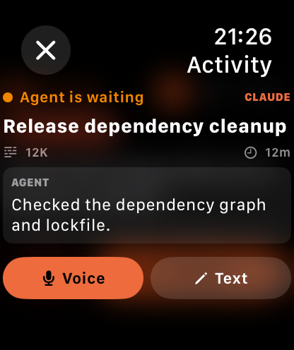

# GrantTap Relay

[](LICENSE)

The public zero-knowledge relay used by [GrantTap](https://granttap.com).
It runs on Cloudflare Workers with Durable Objects, routes WebSockets by room,
and temporarily queues encrypted envelopes while a paired device is offline.

Production health endpoint:
[granttap-relay.sergii-ziborov.workers.dev/health](https://granttap-relay.sergii-ziborov.workers.dev/health)

| Sessions on iPhone | Visible activity on Apple Watch |
| --- | --- |
|  |  |

## What the relay can and cannot see

The relay can see routing metadata: room, sender/recipient roles, IP addresses,
timing, expiry, message sizes, and—when background delivery is enabled—an APNs
device token plus its sandbox/production environment. It receives `nonce` and
`box` as opaque ciphertext. Push alerts contain no command, prompt, path,
session title, or message text.

The relay cannot decrypt commands, questions, agent messages, user replies, or
approval decisions. Device secret keys are created locally and never sent to
this worker. Short-code pairing blobs are encrypted before upload, expire
after 15 minutes, are single-use, and are rate-limited per source.

The complete production worker is intentionally small and public so this
boundary can be audited instead of trusted as a marketing claim.

## Endpoints

| Endpoint | Purpose |
| --- | --- |
| `GET /health` | Liveness check |
| `wss://host/?room=<room>` | Hibernating WebSocket for one pairing room |
| `PUT /pair/<CODE>` | Park an already encrypted short-code pairing blob |
| `GET /pair/<CODE>` | Consume that blob once |
| `PUT /push/register?room=<room>` | Register an APNs token with the room credential |
| `DELETE /push/register?room=<room>` | Remove that APNs token |
| `GET /push/status?room=<room>` | Report provider configuration and registered device count |

Queued messages are capped per recipient and expired before delivery. New
clients attach an opaque delivery id; the relay retains that ciphertext until
the receiving client confirms that it decrypted the envelope. The queue does
not treat a WebSocket write as proof of delivery.

The APNs alert is deliberately generic. It wakes the iPhone so the app can pull
the queued E2EE envelope; approval alerts also carry only the random request id
needed by the registered notification actions. Apple does not guarantee
background execution timing, so the visible generic alert is the fallback—not
a promise of instant silent delivery.

## Run locally

Requires Node.js 20 or newer.

```bash
git clone https://github.com/sergii-ziborov/granttap-relay.git
cd granttap-relay
npm install
npm test
npm run dev
```

Wrangler uses the same Workers runtime locally, including the Durable Object
bindings declared in `wrangler.toml`.

## Deploy to your Cloudflare account

```bash
npx wrangler login
npm run deploy
```

WebSocket relay and offline queues work without application secrets. Background
APNs delivery requires an Apple Push Notification authentication key. Store the
following as encrypted Cloudflare Worker secrets:

```bash
npx wrangler secret put APNS_TEAM_ID
npx wrangler secret put APNS_KEY_ID
npx wrangler secret put APNS_PRIVATE_KEY
```

`APNS_PRIVATE_KEY` is the complete `.p8` content. After deployment, use the
emitted secure WebSocket URL as the relay URL in your GrantTap pairing. Without
all three secrets, `/push/status` honestly reports `enabled: false`; foreground
WebSocket delivery and durable queues keep working.

Never put APNs credentials in `wrangler.toml`, `.env`, a GitHub Actions
variable, or a committed `.dev.vars` file.

For local development, copy `.dev.vars.example` to `.dev.vars`. Git ignores
`.dev.vars`, every `.env*` file except the empty example, private keys,
certificates, and common credential files.

GitHub secret scanning and push protection are enabled for this repository.
Report a suspected leak privately through the repository's
[Security advisories](https://github.com/sergii-ziborov/granttap-relay/security/advisories/new)
instead of opening a public issue.

The checked-in `wrangler.toml` uses the worker name `granttap-relay`. Change
the name if that worker name already exists in your account. If you alter
Durable Object class names, add a new migration instead of rewriting the
existing `v1` migration.

## Related

- MCP bridge: [sergii-ziborov/granttap-mcp](https://github.com/sergii-ziborov/granttap-mcp)
- npm package: [granttap-mcp](https://www.npmjs.com/package/granttap-mcp)
- Product: [granttap.com](https://granttap.com)
- Privacy: [granttap.com/privacy](https://granttap.com/privacy)
- Support: [granttap.com/support](https://granttap.com/support)
- Security policy: [SECURITY.md](SECURITY.md)

GrantTap is not affiliated with Anthropic, OpenAI, Apple, or Cloudflare.
