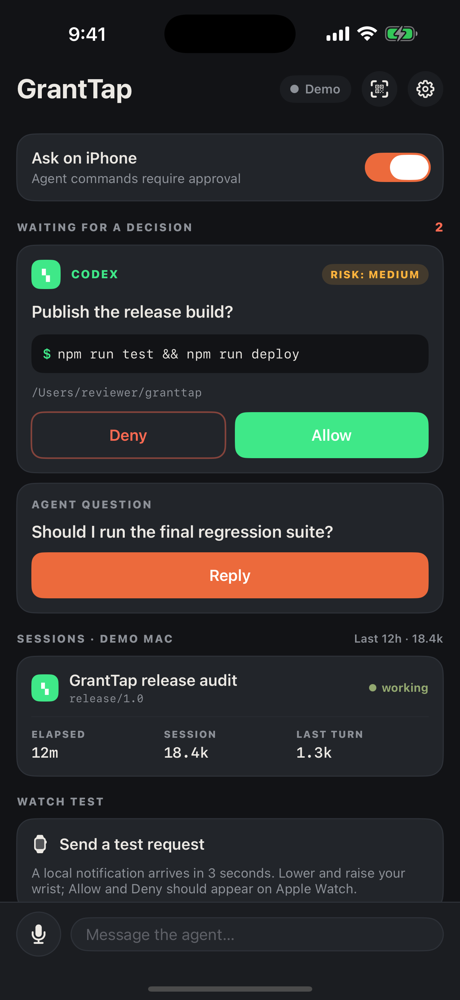

# GrantTap Relay

[](LICENSE)
[](https://github.com/sergii-ziborov/granttap-relay/actions/workflows/ci.yml)

GrantTap Relay is the public, content-blind transport used by
[GrantTap](https://granttap.com). It lets a local GrantTap runtime and its paired
iPhone exchange end-to-end encrypted envelopes when they are on different
networks or one side is temporarily offline. No inbound port on the computer is
required.

The relay can run as a Cloudflare Worker with Durable Objects or as the included
Node service with SQLite. Both runtimes route authenticated WebSockets by
opaque room, retain bounded ciphertext for offline delivery, and can send a
generic, task-content-free APNs alert so the iPhone reconnects and decrypts
locally.

| Task-first control on iPhone | Current tasks on Apple Watch |
| --- | --- |
|  |  |

The screenshots are real deterministic Demo captures from the current GrantTap
Personal UI. Demo content performs no command and contains no user data.

## Why the relay exists

```text
Local GrantTap runtime  <=>  ciphertext relay  <=>  iPhone  <=>  Apple Watch
                              |                     ^
                              +---- APNs wake ------+
```

Computers and phones are commonly behind NAT, change networks, sleep, or lose
connectivity. A direct socket is therefore not a dependable remote-control
path, and it cannot deliver while the other peer is offline. The relay supplies
only rendezvous, bounded retry, and wake-up delivery. Apple Watch communicates
through its paired iPhone; it does not connect to this Worker directly.

This repository is deliberately a small infrastructure component, not the
GrantTap application backend. Its product surface is stable by design, while
maintenance continues for transport compatibility, security, reliability, and
Cloudflare runtime changes. Provider adapters and local agent control live in
[granttap-mcp](https://github.com/sergii-ziborov/granttap-mcp); the iPhone and
Watch experiences live in GrantTap.

The Worker does not provide:

- model or coding-agent execution;
- a plaintext Task, session, prompt, or conversation database;
- a credential vault;
- browser pairing, browser approvals, or a browser control plane;
- access to a computer filesystem or shell.

## What the relay can and cannot see

The relay is content-blind, not metadata-blind. It can see routing metadata:
room, sender/recipient roles, IP addresses,
timing, expiry, message sizes, and—when background delivery is enabled—an APNs
device token plus its sandbox/production environment. It receives `nonce` and
`box` as opaque ciphertext. The fixed APNs alert contains no command, prompt,
path, session title, or message text.

The relay cannot decrypt commands, questions, agent messages, user replies, or
approval decisions. Device and per-task secret keys are created locally and
never sent to this worker. Pairing hand-off uses a random 128-bit mailbox id
that is independent from the 256-bit transfer key kept in the QR/manual token.
The worker receives the mailbox and ciphertext, but never the transfer key.
Mailboxes expire after 15 minutes and are single-use.

Project Mesh does not add a coordination database or plaintext API. Project
snapshots, Task Capsules, handoff receipts, resource claims, dependencies, and
agent-to-agent questions travel only inside the same opaque encrypted envelope
format. Project keys and Task keys are granted by authorized endpoints; the
Worker sees only the existing bounded routing metadata and ciphertext.

The Personal relay has no browser approval, browser pairing, or vault endpoint.
The WebSocket and Durable Object path carries authenticated ciphertext. APNs
receives only a fixed generic alert and neutral wake flag, never the encrypted
envelope or its task metadata. One task key cannot decrypt a second task; a
device can open that second task only if its independent key was explicitly
granted to that device.

The complete production worker is intentionally small and public so this
boundary can be audited instead of trusted as a marketing claim.

## Endpoints

| Endpoint | Purpose |
| --- | --- |
| `GET /health` | Liveness check |
| `wss://host/?room=<room>` | Hibernating WebSocket for one pairing room |
| `PUT /pair/<MAILBOX_ID>` | Park an already encrypted pairing blob; no key is sent |
| `GET /pair/<MAILBOX_ID>` | Consume that ciphertext once |
| `PUT /push/register?room=<room>` | Register an APNs token with the room credential |
| `DELETE /push/register?room=<room>` | Remove that APNs token |
| `GET /push/status?room=<room>` | Report provider configuration and registered device count |

Queued messages are capped per recipient, by total stored bytes, and expired before delivery. New
clients attach an opaque delivery id; the relay retains that ciphertext until
the receiving client confirms that it decrypted the envelope. The queue does
not treat a WebSocket write as proof of delivery. Cloudflare limits one
Durable Object key/value to 2 MB, so encrypted frames above the relay's 1.8 MB
retry budget are delivered only to an already connected peer and are not stored
for offline retry. Client attachment limits keep complete task frames under the
separate 32 MiB WebSocket receive limit.

The APNs payload is a generic time-sensitive alert with title `GrantTap`, the
fixed body `An agent is waiting for an authenticated decision.`, default sound,
`content-available: 1`, and `granttapWake: true`. It contains no task kind,
request id, delivery id, prompt, command, session title, or path. Its background
component asks iOS to pull and decrypt the queued E2EE envelope; the app can then
present task-specific controls locally. Apple does not guarantee background
execution timing, so queue retrieval is best-effort—not a promise of instant
delivery.

A Cloudflare account takeover or Durable Object database export therefore
reveals only ciphertext plus operational metadata (opaque room/mailbox ids,
routing roles, IPs, timing/expiry, sizes, APNs token/environment, and the
neutral wake flag) plus the fixed generic alert text above. There is no
decryption key in Worker code, bindings, storage, logs, or encrypted Worker
secrets. APNs provider credentials can sign notifications but cannot decrypt
GrantTap traffic.

## Run locally

Requires Node.js 22 or newer (the minimum supported by the pinned Wrangler line).

```bash
git clone https://github.com/sergii-ziborov/granttap-relay.git
cd granttap-relay
npm install
npm test
npm run dev
```

Wrangler uses the same Workers runtime locally, including the Durable Object
bindings declared in `wrangler.toml`. To run the Node and SQLite version, use
`npm start`; it listens on port 3201 and stores data at `DATABASE_PATH`
(default `/data/relay.sqlite3`).

## Deploy the self-hosted Node service

The checked-in Compose service binds only to `127.0.0.1:3201`; terminate TLS
and enforce connection and request limits in the reverse proxy. Create the
server-only `.env` from `.env.example`, create `/srv/data/granttap` for uid
1000, then run:

```bash
docker compose up -d --build
```

`deploy/nginx-relay.conf` is the production reverse-proxy template. It drops
malformed unauthenticated traffic before Node, limits pairing and API requests,
passes WebSocket upgrades, and leaves the ACME challenge path public.
`deploy/backup-granttap-relay*` provides a daily online SQLite backup with an
integrity check and 14-day retention.

When moving an existing Cloudflare deployment to this service, keep already
installed clients online without continuing Durable Object storage writes by
setting `LEGACY_PROXY_ORIGIN` on the old Worker to the private HTTPS origin and
deploying the same code. The Worker then accepts only the documented relay
routes and forwards them to the private service; its Durable Object bindings
remain attached for rollback but are not called by public requests.

## Deploy to your Cloudflare account

```bash
npx wrangler login
npm run deploy
```

WebSocket relay and offline queues work without application secrets. Background
APNs delivery requires an Apple Push Notification authentication key. Store the
following as encrypted Cloudflare Worker secrets:

```bash
npx wrangler secret put APNS_TEAM_ID
npx wrangler secret put APNS_KEY_ID
npx wrangler secret put APNS_PRIVATE_KEY
```

`APNS_PRIVATE_KEY` is the complete `.p8` content. After deployment, use the
emitted secure WebSocket URL as the relay URL in your GrantTap pairing. Without
all three secrets, `/push/status` honestly reports `enabled: false`; foreground
WebSocket delivery and durable queues keep working.

Every WebSocket and push endpoint also requires the pairing's random 256-bit
room credential. First use pins only its SHA-256 digest inside that room's
Durable Object; legacy pairings that predate this credential must re-pair.

Never put APNs credentials in `wrangler.toml`, `.env`, a GitHub Actions
variable, or a committed `.dev.vars` file.

For local development, copy `.dev.vars.example` to `.dev.vars`. Git ignores
`.dev.vars`, every `.env*` file except the empty example, private keys,
certificates, and common credential files.

GitHub secret scanning and push protection are enabled for this repository.
Report a suspected leak privately through the repository's
[Security advisories](https://github.com/sergii-ziborov/granttap-relay/security/advisories/new)
instead of opening a public issue.

The checked-in `wrangler.toml` uses the worker name `granttap-relay`. Change
the name if that worker name already exists in your account. If you alter
Durable Object class names, add a new migration instead of rewriting the
existing `v1` migration.

## Related

- MCP bridge: [sergii-ziborov/granttap-mcp](https://github.com/sergii-ziborov/granttap-mcp)
- npm package: [granttap-mcp](https://www.npmjs.com/package/granttap-mcp)
- Product: [granttap.com](https://granttap.com)
- Privacy: [granttap.com/privacy](https://granttap.com/privacy)
- Support: [granttap.com/support](https://granttap.com/support)
- Security policy: [SECURITY.md](SECURITY.md)

GrantTap is not affiliated with Anthropic, OpenAI, Apple, or Cloudflare.
